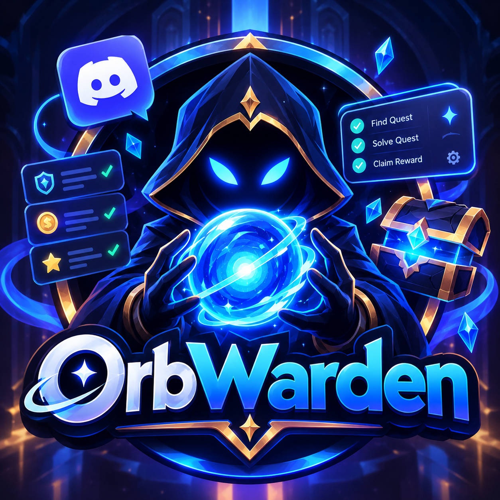

<p align="center">
  
</p>

<h1 align="center">OrbWarden</h1>

<p align="center">
  <strong>Discord quest automation — complete video, stream, game, and activity quests automatically.</strong>
</p>

<p align="center">
  <a href="https://github.com/36go/OrbWarden/releases/tag/v1.1.1">
    
  </a>
  <a href="https://github.com/36go/OrbWarden/blob/main/LICENSE">
    
  </a>
  
  
</p>

---

## What is OrbWarden?

OrbWarden is a desktop app that automates Discord quest completion. It supports CDP (Chrome DevTools Protocol) integration for direct Discord control, and a simulated game mode for quests that require running a game.

### Key Features

- **Quest Auto-Completion** — Video, stream, play, and activity quests
- **CDP Mode** — Direct Chrome DevTools Protocol integration with Discord
- **Simulated Game Mode** — Runs a lightweight simulation for game quests (Windows/macOS/Linux)
- **Batch Quest Runner** — Complete multiple quests in sequence
- **Multi-Account Support** — Switch between multiple Discord accounts
- **Orbs Balance Tracking** — View and claim orbs rewards
- **Claim All Rewards** — One-click batch claiming of completed quest rewards
- **17 Languages** — English, Arabic, Chinese, Japanese, Korean, French, German, Spanish, Portuguese, Russian, Turkish, Thai, Vietnamese, Polish, Indonesian, Traditional Chinese, European Portuguese

## Download

Download the latest release from the [Releases page](https://github.com/36go/OrbWarden/releases/tag/v1.1.1):

| Platform | File | Notes |
|----------|------|-------|
| **Windows** | `orbwarden-v1.1.1-windows-x64.exe` | Standalone executable, no install needed |
| **Linux** | Build from source (see below) | Requires system dependencies |
| **macOS** | Build from source | Requires Xcode Command Line Tools |

## Build from Source

### Prerequisites

| Tool | Version |
|------|---------|
| [Node.js](https://nodejs.org/) | 18+ |
| [pnpm](https://pnpm.io/) | 8+ |
| [Rust](https://rustup.rs/) | latest |
| [Tauri CLI](https://v2.tauri.app/start/prerequisites/) | 2.x |

### Linux Dependencies

```bash
# Ubuntu/Debian
sudo apt update
sudo apt install -y libwebkit2gtk-4.1-dev libappindicator3-dev librsvg2-dev \
  patchelf libssl-dev libgtk-3-dev libsoup-3.0-dev libjavascriptcoregtk-4.1-dev

# Arch
sudo pacman -S webkit2gtk-4.1 appstream-glib librsvg patchelf openssl gtk3 libsoup3

# Fedora
sudo dnf install -y webkit2gtk4.1-devel libappindicator-gtk3-devel librsvg2-devel \
  patchelf openssl-devel gtk3-devel libsoup3-devel
```

### Build

```bash
git clone https://github.com/36go/OrbWarden.git
cd OrbWarden
pnpm install
pnpm run tauri:build
```

Output:
- Binary: `src-tauri/target/release/orbwarden`
- Bundles: `src-tauri/target/release/bundle/`

### Windows Setup Script

```powershell
git clone https://github.com/36go/OrbWarden.git
cd OrbWarden
powershell -ExecutionPolicy Bypass -File setup.ps1
```

### Quick Launch (Dev Mode)

```bash
# Linux / macOS
pnpm run tauri:dev

# Windows
powershell -ExecutionPolicy Bypass -File launch.ps1
```

## Usage

1. Launch OrbWarden
2. Log in with your Discord token or via CDP
3. Go to **Settings > Discord Integration** to launch Discord with CDP enabled
4. Accept quests from the **Home** tab
5. Click **Start** to begin quest completion
6. Use **Claim All** to batch-claim completed quest rewards

## Discord Integration

OrbWarden supports two modes:

| Mode | Description |
|------|-------------|
| **CDP** | Connects to Discord via Chrome DevTools Protocol. Requires launching Discord with remote debugging enabled. |
| **Simulate** | Runs a lightweight game simulation. Works without Discord running. |

To enable CDP mode:
1. Go to **Settings > Discord Integration**
2. Select your Discord installation (supports Official Discord, Vesktop, ArmCord, Legcord, Discord Canary)
3. Click **Launch with CDP** — OrbWarden will start Discord with remote debugging enabled

## How It Works

OrbWarden uses:
- **Tauri 2** — Rust backend with web frontend
- **Chrome DevTools Protocol** — Direct browser automation
- **Discord API** — Quest and reward management
- **WebView2 / WebKit** — Native web rendering

## 🔨 Community

Join our Discord server for support, updates, and discussion:

[](https://discord.gg/se6VMAbjC)

## License

[MIT](LICENSE) — (c) 2025 Masterain

## Contributing

Contributions are welcome! Please open an issue or submit a pull request on [GitHub](https://github.com/36go/OrbWarden).
